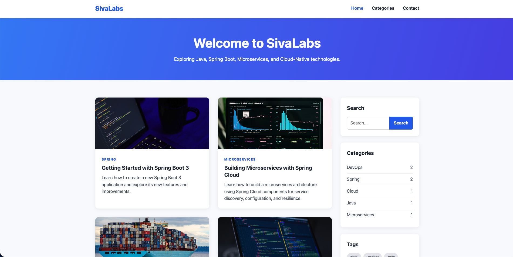

# Hugo Tech Blog Classic Theme

[Demo](https://sivaprasadreddy.github.io/hugo-tech-blog-classic-theme/)



## Features

- Clean simple design
- Light and Mobile-Friendly
- Simple blog and taxonomy

## Requirements
- [Hugo](https://gohugo.io/installation/) extended edition, v0.164 or higher

## Quick Start

```sh
hugo new project quickstart
cd quickstart
git init
git submodule add https://github.com/sivaprasadreddy/hugo-tech-blog-classic-theme themes/hugo-tech-blog-classic-theme
echo "theme = 'hugo-tech-blog-classic-theme'" >> hugo.toml
hugo server
```
